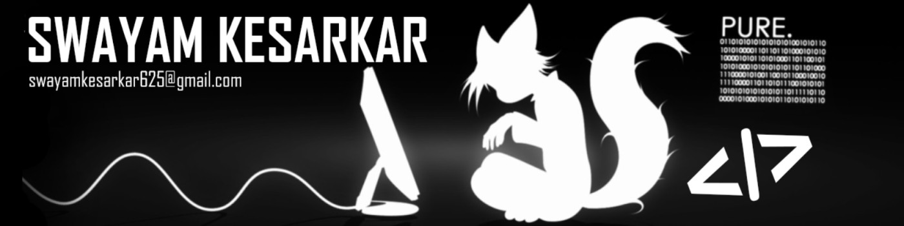

# Heyy!! NERD-SWAYAM here...

### ABOUT ME
I am a Nerdy guy who keeps his major interest in Technologies and Computer Science.
I spend my most of the time alone watching animes or learning and building projects.
I keep my interest of expertise in learning Machine Learning, LLM functioning and their implementations.

And I use Ubuntu btw...

### PROJECTS
1. News-Senti [ https://news-senti.onrender.com ]
2. KrishiScan

### CONNECT WITH ME
You can contact me for any free collabration or idea discussion
Mail: (swayamkesarkar625@gmail.com)
LinkedIN: [https://www.linkedin.com/in/swayam-kesarkar-b05261272]
Github: [https://github.com/LightYagami625/LightYagami625]

### TECHNOLOGIES

               

## **"BELIEVE IN YOURSELF AND NEVER GIVE UP!!! THAT's MY NINJA WAY!!!"**    **"BELIEVE IT!!"**
